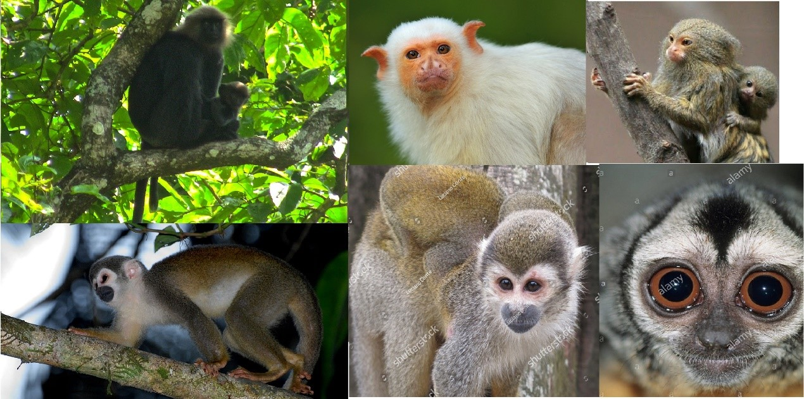

# ResNet18 CNN 10-monkey-species classification
> 从ResNet开始对卷积神经网络的学习

## Requirements
* python 3.6.9
* pip 20.0.0+

## Installation
> 如果有虚拟环境(virtualenv、conda、..)，建议在虚拟环境安装

Windows & Linux:

```sh
pip install matplotlib sklearn numpy pandas jupyter
pip install tensorflow==2.1
```

# Prepare data 10-monkey-species

1. Download dataset from kaggle [10-monkey-species](https://www.kaggle.com/slothkong/10-monkey-species)
2. Extract the file to "data/10-monkey-species" folder
3. Delete duplicate folders, tree it like this:
```sh
    ├─callbacks
    └─data
        └─10-monkey-species
            ├─training
            │  ├─n0
            │  ├─n1
            │  └─n2
            └─validation
                ├─n0
                ├─n1
                └─n2
```

## Usage example

* open terminal/cmd in this project folder
```sh
jupyter notebook

```
